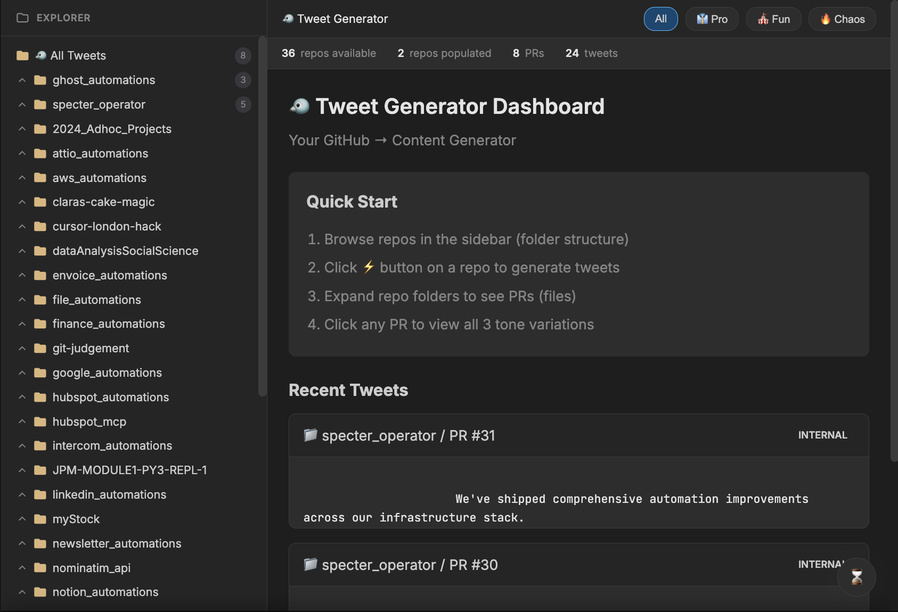

# Specter Changelog Agent

Automated changelog generator that fetches merged GitHub PRs, summarizes them using AI (Cursor SDK), and formats them according to Specter's style guides.



## Setup

1. **Install dependencies:**
   ```bash
   npm install
   ```

   **Note:** The `@cursor-ai/january` package is used for AI summarization. If this package is not publicly available, you may need to:
   - Use an alternative Cursor SDK package
   - Or implement a custom wrapper for the Cursor API
   - Check the [Cursor documentation](https://cursor.sh) for the latest SDK information

2. **Configure environment variables:**
   Copy `.env.example` to `.env` and fill in your values:
   ```bash
   cp .env.example .env
   ```

   Required variables:
   - `GITHUB_TOKEN` - GitHub Personal Access Token with `repo` read access
   - `GITHUB_REPOS` - Comma-separated list of repos (e.g., `specter-dev/pipeliner,specter-dev/product`)
   - `GITHUB_DEFAULT_BRANCH` - Default branch name (defaults to `main`)

   Optional variables:
   - `INTERCOM_ACCESS_TOKEN` - For future Intercom API integration
   - `INTERCOM_RELEASE_NOTES_ARTICLE_ID` - Intercom article ID
   - `TIMEZONE` - Timezone for date formatting (defaults to `Europe/London`)
   - `CHANGELOG_STATE_FILE` - Path to state file (defaults to `.changelog-state.json`)
   - `CHANGELOG_INITIAL_SINCE` - ISO timestamp for historical backfill (defaults to 1970-01-01)

## Usage

### Run the changelog job:
```bash
npm run changelog:run
```

### Run with historical backfill:
```bash
npm run changelog:run -- --since=2025-01-01
```

### Build and run compiled version:
```bash
npm run changelog:build
npm run changelog:run:compiled
```

### Run the live dashboard (PR → tweets)
```bash
# make sure .env has at least:
# GITHUB_TOKEN=ghp_xxx
# (leave GITHUB_REPOS empty to list all accessible repos, or set comma-separated repos)
npm run server
```

- Opens on `http://localhost:3001`
- Endpoints: `/api/repos`, `/api/tweets`, `/api/populate`
- Use the dashboard to click ⚡ on a repo, watch progress, and view/generated tweets immediately

## Output

The job generates:
- `CHANGELOG.md` - Full changelog with all entries (including internal)
- `intercom-release-notes-latest.md` - User-facing entries only (ready to paste into Intercom)

## How It Works

1. Fetches merged PRs from GitHub since the last run (tracked in `.changelog-state.json`)
2. Classifies each PR into sections: New, Improvements, Fixes, or Internal
3. Uses Cursor AI to generate Specter-style bullet points
4. Groups entries by date and formats them according to Specter's style guide
5. Prepends new entries to `CHANGELOG.md` and generates Intercom-ready markdown

## Testing

```bash
npm test
```

## Architecture

- `src/config.ts` - Configuration and environment variable loading
- `src/github/` - GitHub API client and PR fetching
- `src/changelog/` - Classification, heading generation, and markdown assembly
- `src/cursor/` - Cursor AI agent integration for PR summarization
- `src/state/` - State management for tracking processed PRs
- `src/jobs/` - Main job orchestration

## References

All style guides and specifications are in the `scope/` directory:
- `specter-release-notes.md` - Golden reference for tone and formatting
- `intercom-style-guide.md` - Rules for Intercom content
- `changelog-format-patterns.md` - Mapping rules for PRs → changelog entries
- `pr-summarization-prompt.md` - AI prompt for PR summarization
- `changlelog-assembly-prompt.md` - Rules for assembling entries into markdown

